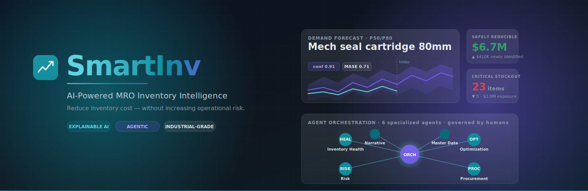

<div align="center">

# SmartInv

<picture>
  
</picture>

**AI-Powered MRO Inventory Intelligence Platform**

Reduce MRO inventory cost without increasing operational risk.

[](docs/project/roadmap.md)
[](#license)
[](docs/index.md)

</div>

---

## Introduction

SmartInv is an **AI-powered platform for MRO (Maintenance, Repair & Operations) inventory management**, designed for industrial customers in manufacturing, oil & gas, logistics, and utilities. It acts as an **intelligent decision and storytelling layer on top of existing ERP, EAM, procurement, and inventory systems** — transforming fragmented operational data into trusted recommendations and executive-grade narratives.

SmartInv is not a dashboard tool. It is a *trusted intelligence layer* whose role is to answer questions like:

- How much capital is trapped in MRO inventory?
- Where is the organization exposed to operational risk?
- Which inventory decisions reduce cost without increasing downtime risk?
- What should the user do next, who should approve it, and how should the action be tracked?

Every recommendation it produces is **explainable, traceable, challengeable, and governed**.

---

## Executive Summary

| Item | Description |
|---|---|
| **Product** | SmartInv — intelligent decision layer for MRO inventory |
| **Target sectors** | Manufacturing, Oil & Gas, Logistics, Utilities |
| **Core promise** | Reduce MRO inventory cost without increasing operational risk |
| **Differentiator** | Agentic AI + Explainability + Executive Storytelling, governed end-to-end |
| **Integration model** | Sits *above* IBM Maximo, SAP, Oracle, Infor, Dynamics — does not replace them |
| **MVP focus** | Inventory Health · AI Min/Max Recommendations · Critical Spare Risk · Conversational Analyst |
| **Strategic moat** | Trust (explainable, auditable AI) for industrial buyers |
| **Status** | MVP architecture and roadmap defined |

SmartInv combines classical inventory optimization, modern machine learning, and agentic orchestration to support planners, maintenance leaders, procurement, finance, and C-level stakeholders.

---

## Product Vision and Positioning

> **SmartInv is the trusted intelligence layer that turns MRO inventory data into operational, financial, and risk decisions — with explainable recommendations and governed agentic workflows.**

### Strategic pillars

| Pillar | Definition |
|---|---|
| **Trust** | Every recommendation is explainable, traceable, and challengeable. Numbers are never invented. |
| **Storytelling** | Inventory data becomes financial, operational, and risk narratives — not just charts. |
| **Agentic intelligence** | Specialized agents collaborate under human governance to move from insight to action. |
| **Integration-first** | Sits above Maximo, SAP, Oracle, Infor, Dynamics, and lakehouses; does not replace them. |
| **Risk-aware optimization** | Optimizes capital and service level without compromising uptime and safety. |

### What SmartInv is *not*

- ❌ Not a replacement for an EAM/ERP.
- ❌ Not a generic BI dashboard.
- ❌ Not a fully autonomous decision-maker. Agents *propose*; humans *dispose*.
- ❌ Not an AI demo product. Every claim it makes is grounded in governed metrics.

### Positioning statement

For **industrial organizations** that struggle with excess MRO inventory and operational risk, SmartInv is an **AI-powered intelligence layer** that delivers **explainable, governed recommendations and executive-grade narratives** by combining classical optimization, ML forecasting, and agentic orchestration on top of existing ERP/EAM systems.

Unlike traditional inventory tools that optimize cost in isolation, SmartInv connects inventory decisions to **operational risk, downtime exposure, supplier reliability, and financial impact**, with full traceability from any recommendation back to source records.

---

## Target Users and Personas

SmartInv serves an entire decision chain — from the planner reviewing daily exceptions to the C-level sponsor demanding clarity on capital and risk.

| Persona | Primary Concern | Typical Use of SmartInv |
|---|---|---|
| **Inventory Planner** | Optimize min/max, reorder points, safety stock; resolve daily exceptions. | Reviews AI recommendations, approves low-risk actions, manages excess items. |
| **Maintenance Manager** | Ensure spare availability for critical assets and preventive plans. | Approves critical-spare policy changes, monitors stockout risk per asset. |
| **Procurement Lead** | Manage suppliers, contracts, lead times, prices, and purchase orders. | Acts on late-PO risk, drafts RFQs, monitors supplier scorecards. |
| **Warehouse Supervisor** | Own physical accuracy, movements, transfers, and storeroom health. | Executes transfers, reviews anomalies, validates stock integrity. |
| **Finance / CFO Office** | Monitor working capital trapped in inventory and capital efficiency. | Reviews capital impact of decisions, signs off on high-value actions. |
| **COO / VP Operations** | Ensure operational continuity and risk visibility across plants. | Consumes risk narratives and plant comparisons. |
| **Reliability Engineer** | Connect spare strategy to asset criticality and failure modes. | Validates critical-spare lists and obsolescence candidates. |
| **Executive Sponsor / Board** | See narratives, not screens: capital, risk, opportunity, progress. | Reads monthly executive briefs and board packs. |

---

## Documentation

> The full SmartInv documentation lives under [`docs/`](docs/index.md). Start with the documents below.

| Document | Purpose |
|---|---|
| [📐 Recommended Software Architecture (full)](docs/architecture/full-architecture.md) | Complete reference architecture for the production-grade platform (web + mobile, agents, data, ML, integration, security). |
| [🚀 MVP Software Architecture](docs/architecture/mvp-architecture.md) | The simplified, ship-first architecture for the MVP — no Temporal, no Kafka, 3-component data platform. |
| [🛠 Engineering Principles](docs/process/engineering-principles.md) | Code, testing, architecture, and process principles — startup-pragmatic but enterprise-aware. |
| [📜 Decisions](docs/project/decisions.md) | Architecture Decision Records (ADRs) — every directional choice and its trade-offs. |
| [🗺 Roadmap (Kanban)](docs/project/roadmap.md) | Vertical task list in Kanban format (Backlog · Doing · Blocked · Review · Done). |
| [🧭 Project operating instructions](AGENTS.md) | Conventions any AI assistant or new contributor must follow when working in this repo. |

### Supplementary artefacts

- `docs/smartinv_feature_specification.docx` — Detailed functional, ML, agentic, and non-functional feature specification.
- `docs/smartinv_ui_vs_spec_comparison.docx` — Coverage analysis of the UI concept against the feature specification.
- `docs/smartinv-ui.html` — High-fidelity UI concept (12 screens) used as a UX reference.
- `docs/SmartInv_Architecture.docx` — Original software architecture document (visual design baseline).

---

## Quick orientation for new contributors

1. Read this `README.md`.
2. Read [`AGENTS.md`](AGENTS.md) for project operating instructions.
3. Read [`docs/architecture/mvp-architecture.md`](docs/architecture/mvp-architecture.md) to understand what we are building first.
4. Read [`docs/process/engineering-principles.md`](docs/process/engineering-principles.md) to understand *how* we build.
5. Check [`docs/project/roadmap.md`](docs/project/roadmap.md) for what to pick up next.

---

## Local development

### Prerequisites

| Tool | Version | Install |
|---|---|---|
| Node | `22 LTS` | nvm / fnm / volta |
| pnpm | `11.x`   | `corepack enable && corepack prepare pnpm@11.6.0 --activate` |
| Python | `3.12` | [pyenv](https://github.com/pyenv/pyenv) or [uv-managed](https://docs.astral.sh/uv/) |
| uv | latest | `curl -LsSf https://astral.sh/uv/install.sh \| sh` |

### Install

```bash
# JS/TS workspace
pnpm install

# Python workspace (creates .venv and resolves all members)
uv sync --all-packages
```

### Run the web app

```bash
pnpm --filter=@smartinv/web dev
# http://localhost:3000
```

### Run the API

```bash
uv run uvicorn api.main:app --reload --app-dir services/api/src
# http://localhost:8000/health
# http://localhost:8000/docs
```

### Common scripts

```bash
pnpm lint        # Biome lint+format across the whole monorepo
pnpm typecheck   # tsc --noEmit across all packages (turbo)
pnpm build       # production build (turbo)
pnpm test        # vitest (turbo)

uv run ruff check services         # Python lint
uv run ruff format --check services
uv run mypy services               # Python typecheck
uv run pytest -v                   # Python tests
```

CI runs the same commands on every push and PR — see `.github/workflows/ci.yml`.

---

## License

Proprietary — © SmartInv. All rights reserved.
Reuse and distribution require explicit written authorization.

---

<div align="center">

*SmartInv — a trusted intelligence layer for MRO inventory decisions.*

</div>
